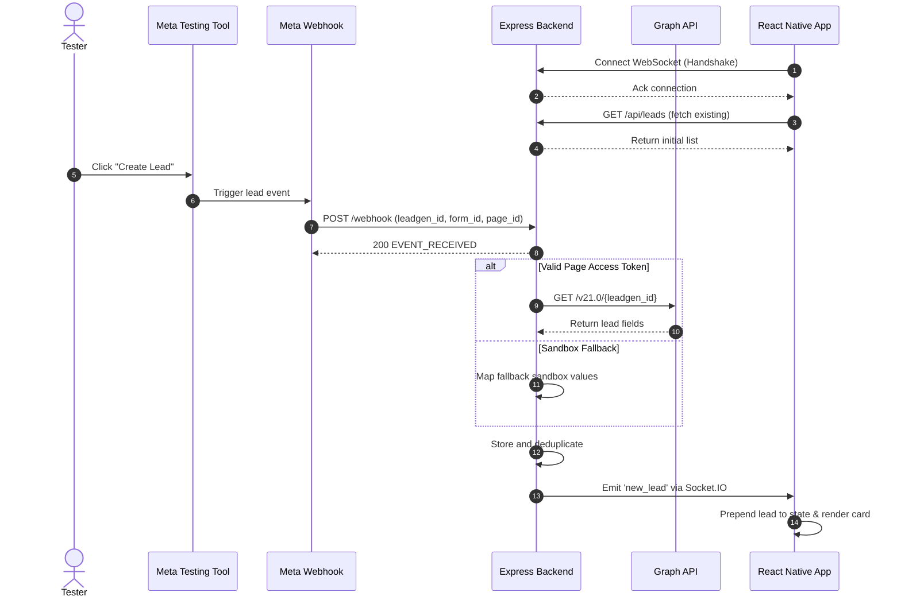

# System Architecture & Technical Flow

This document outlines the architecture and data flow for the real-time Meta Lead Ads integration.

---

## 1. Architecture Overview

```mermaid
flowchart TD
    subgraph Meta ["Meta Platform"]
        TEST_TOOL["Lead Ads Testing Tool"]
        WEBHOOK["Page Webhooks Engine"]
        GRAPH["Graph API v21.0"]
        TEST_TOOL -->|Simulate Form Submit| WEBHOOK
    end

    subgraph Ingress ["Public Ingress"]
        TUNNEL["HTTPS Tunnel (localtunnel / ngrok)"]
    end

    subgraph BackendServer ["Node.js Backend"]
        RECEIVER["Express Webhook Handler"]
        RESOLVER["Lead Details Service"]
        CACHE["In-Memory Store (leads.json)"]
        WS_SERVER["Socket.IO Server"]

        RECEIVER -->|200 OK + Async Process| RESOLVER
        RESOLVER -->|Parsed Lead Record| CACHE
        CACHE -->|Emit 'new_lead'| WS_SERVER
    end

    subgraph Client ["React Native Mobile App"]
        WS_CLIENT["Socket.IO Client"]
        HOOK["React State Hook"]
        FEED["Leads List View"]

        WS_SERVER -.->|WebSocket Event| WS_CLIENT
        WS_CLIENT --> HOOK
        HOOK --> FEED
    end

    WEBHOOK -->|POST /webhook| TUNNEL
    TUNNEL --> RECEIVER
    RESOLVER -->|GET /{leadgen_id}| GRAPH
```

---

## 2. Event Sequence



---

## 3. Component Details

### Backend (`backend/src/server.js`)
- **Webhook Handshake (`GET /webhook`):** Validates `hub.mode` and `hub.verify_token` against the configured secret. Returns `hub.challenge` on success with HTTP 200.
- **Event Ingestion (`POST /webhook`):** Listens for events on `entry[].changes[].field === 'leadgen'`. Responds with 200 immediately to avoid Meta webhook retries and processing timeouts.
- **Lead Resolver (`backend/src/metaService.js`):** Queries Meta Graph API to resolve `field_data` (name, email, phone). If in sandbox mode without an active token, it falls back to structured dummy data.
- **Storage & Deduplication (`backend/src/leadsStore.js`):** Stores leads in memory with a JSON file backup. Prevents duplicate submissions using `leadgen_id`.

### Mobile Application (`mobile/App.js`)
- Built with React Native & Expo.
- Establishes a persistent Socket.IO connection on load.
- Listens for `new_lead` socket events and prepends incoming leads to state array.
- Highlights newly received leads with a brief active badge.
- Includes a configuration modal to switch between `localhost`, `10.0.2.2` (Android emulator), and LAN IP without rebuilding.

---

## 4. Design Decisions & Trade-offs

- **WebSockets vs HTTP Polling:** WebSockets were chosen because the requirement calls for the lead to appear without touching the device. Polling would waste battery and introduce unnecessary latency.
- **WebSockets vs Mobile Push Notifications (FCM/APNs):** Push notifications are better suited for background alerts when the app is closed. Since the assignment specifies an already-open screen, WebSockets provide immediate delivery without requiring external push credentials.
- **Idempotency:** Webhook deliveries can occasionally duplicate if network retries occur. Deduplication by `leadgen_id` prevents duplicate renders.
